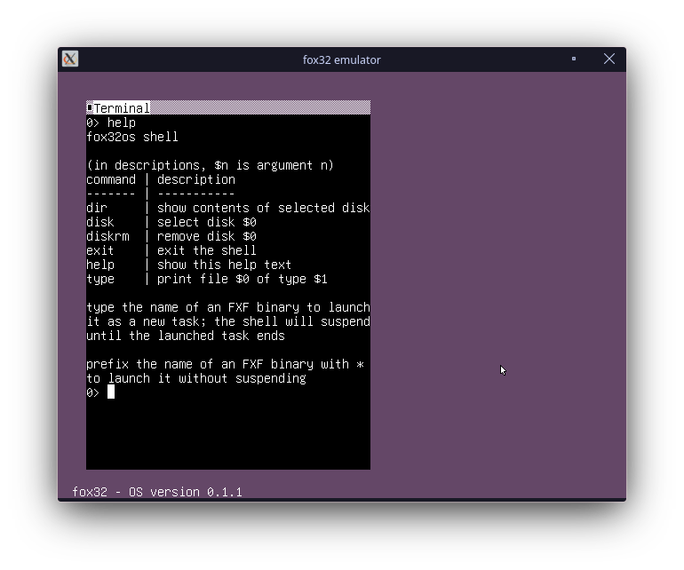

# fox32

  
(logo by [ZenithNeko](https://zencorner.xyz/contacts.html))

This is the reference emulator of the fox32 platform. See the [organization root](https://github.com/fox32-arch) README for general details.

## Getting Started

Prebuilt Linux binaries of the latest commit are available on the [GitHub Actions page](https://github.com/fox32-arch/fox32/actions).

Releases available on the [Releases page](https://github.com/fox32-arch/fox32/releases) are **very outdated** at the moment and should not be used.

### Building

Download the latest release or commit of [**fox32rom**](https://github.com/fox32-arch/fox32rom), and place the downloaded `fox32.rom` file into the root directory of this repo. Then simply run `make`. The resulting binary will be saved as `fox32`. Optionally you may build for a different target with `make TARGET=<target>`, see the Makefile for details.

### Usage

The following arguments are valid:
- `--disk <file>`: mount the specified file as a disk
- `--rom <file>`: use the specified file as the boot ROM; if this argument is not specified then the embedded copy of **fox32rom** is used
- `--debug`: print a disassembly of each instruction as it runs

The most common use case is passing the [**fox32os**](https://github.com/fox32-arch/fox32os) disk image as the first disk: `./fox32 --disk fox32os.img`

See [encoding.md](docs/encoding.md) and [cpu.md](docs/cpu.md) for information about the instruction set.

## License
This project is licensed under the [MIT license](LICENSE).
